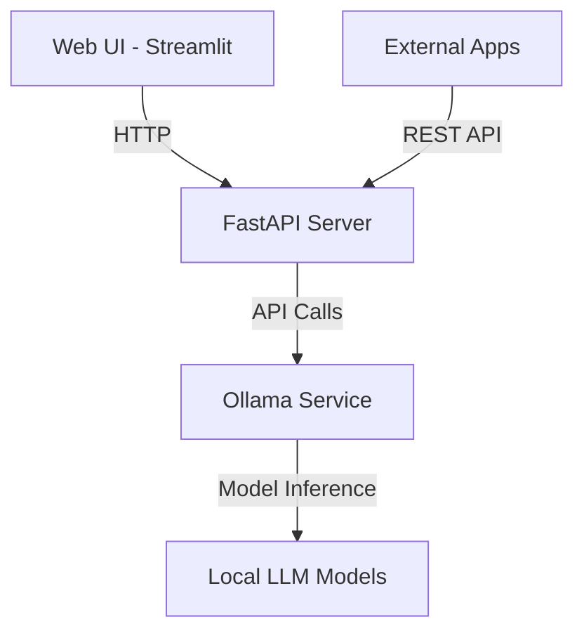

# Local LLM Chat Interface

A Streamlit-based chat interface with API support for interacting with local LLMs through Ollama. This project provides both a web-based chat interface and a REST API for integrating local language models into your applications.

## Architecture



## Features

- 🌐 Web-based chat interface using Streamlit
- 🚀 FastAPI-based REST API
- 🔄 Integration with Ollama for local LLM inference
- 🐳 Docker support for easy deployment
- ⚡ Real-time text generation
- 📚 Support for multiple LLM models

## Prerequisites

- Python 3.8+
- [Ollama](https://ollama.ai/) installed and running
- Docker (optional for container deployment)

## Project Structure

```
.
├── src/
│   ├── chat_app.py      # Streamlit chat interface
│   ├── api_server.py    # FastAPI REST API
│   └── setup.py         # Package setup
├── tests/               # Test suite
├── docs/                # Documentation
├── models/              # Model configurations
├── requirements.txt     # Python dependencies
├── Dockerfile          # Container definition
└── docker-compose.yml  # Container orchestration
```

## Installation

1. Clone the repository:
   ```bash
   git clone https://github.com/voolyvex/Local-LLM.git
   cd Local-LLM
   ```

2. Install dependencies:
   ```bash
   pip install -r requirements.txt
   ```

3. Make sure Ollama is running with your desired model:
   ```bash
   ollama run mistral
   ```

## Usage

### Running the Chat Interface

```bash
streamlit run src/chat_app.py
```

### Running the API Server

```bash
python src/api_server.py
```

### Using Docker

```bash
docker-compose up
```

## API Endpoints

- `POST /api/generate`: Generate text from a prompt
- `GET /api/models`: List available models

## Contributing

Contributions are welcome! Please feel free to submit a Pull Request.

## License

This project is open source and available under the MIT License.
