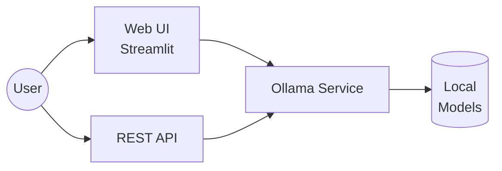

# Local LLM Chat Interface 🤖

A streamlined chat interface for running local language models through Ollama, with both web UI and API access.

## Architecture



## Quick Start 🚀

1. **Prerequisites**:
   - Python 3.8+
   - [Ollama](https://ollama.ai/download)

2. **Install & Run**:
   ```bash
   # Clone and setup
   git clone https://github.com/voolyvex/Local-LLM.git
   cd Local-LLM
   python -m venv venv

   # Activate virtual environment
   # Windows:           # macOS/Linux:
   .\venv\Scripts\activate    # source venv/bin/activate

   # Install and launch
   pip install -r requirements.txt
   python src/launcher.py
   ```

3. Open `http://localhost:8501` in your browser

## System Requirements

- Minimum: 8GB RAM, 4 CPU cores
- Recommended: 16GB RAM, 8 cores, NVIDIA GPU (8GB+ VRAM)

## Features

- Web interface with Streamlit
- REST API for integration
- Text-to-Speech support
- Multiple model support (Mistral, CodeLlama, Mixtral)

## Documentation

- [Platform Setup Guide](docs/platform_setup.md)
- [API Documentation](docs/api.md)
- [Troubleshooting](docs/platform_setup.md#troubleshooting-checklist)

## License

MIT License - see [LICENSE](LICENSE) file
