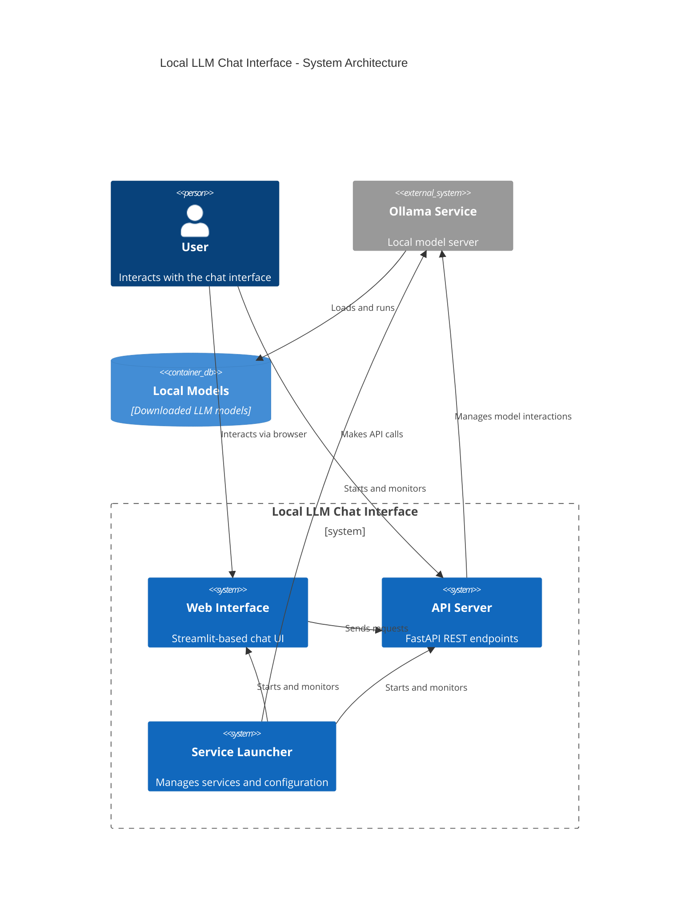

# Local LLM Chat Interface 🤖

A private server and web UI for running local language models through Ollama, with API access.

<div align="center">

<p><i>Streamlit interface</i></p>
</div>


## Quick Start 🚀

### Using Docker (Recommended)
```bash
# Pull and run with one command (includes Ollama)
docker run -d --name local-llm \
  -p 8501:8501 -p 8000:8000 \
  --gpus all \  # Optional: for GPU support
  voolyvex/local-llm:latest

# Or build and run locally
git clone https://github.com/voolyvex/Local-LLM.git
cd Local-LLM
docker compose up -d

# ☝️ Docker must be running for commands to work
# No need to install Ollama separately when using Docker
```

### Manual Setup
1. **Prerequisites**:
   - Python 3.8+
   - [Ollama](https://ollama.ai/download) - **REQUIRED**: Must be installed first!
     - Windows: Run installer and restart your terminal
     - macOS: `brew install ollama`
     - Linux: `curl -fsSL https://ollama.ai/install.sh | bash`

2. **Install Python dependencies**:
   ```bash
   # Clone and setup
   git clone https://github.com/voolyvex/Local-LLM.git
   cd Local-LLM
   
   # Create and activate virtual environment
   # Windows:
   python -m venv venv
   .\venv\Scripts\activate
   
   # macOS/Linux:
   python3 -m venv venv
   source venv/bin/activate
   
   # Install dependencies
   pip install -r requirements.txt
   ```

3. **Start Ollama**:
   ```bash
   # Start Ollama in a terminal window
   # Windows: Make sure you've restarted your terminal after installation
   ollama serve
   
   # In a new terminal window, pull the default model
   ollama pull mistral
   ```

4. **Start the application**:
   ```bash
   # Make sure you're in the Local-LLM directory
   # and your virtual environment is activated
   
   python src/launcher.py
   ```

5. Open `http://localhost:8501` in your browser

### Troubleshooting

1. **Ollama Not Found**:
   - Windows: Make sure you've restarted your terminal after installation
   - Check if Ollama is in your PATH
   - Try running with full path:
     - Windows: `"C:\Program Files\Ollama\ollama.exe" serve`
     - macOS: `/opt/homebrew/bin/ollama serve` or `/usr/local/bin/ollama serve`
     - Linux: `/usr/local/bin/ollama serve`

2. **Port Already in Use**:
   - Check if Ollama is already running: `netstat -ano | findstr :11434`
   - Windows: Check Task Manager for `ollama.exe`
   - Unix: `ps aux | grep ollama`

3. **Model Download Issues**:
   - Ensure you have stable internet connection
   - Try pulling the model manually: `ollama pull mistral`
   - Check disk space in Ollama's model directory:
     - Windows: `%LOCALAPPDATA%\Ollama`
     - macOS/Linux: `~/.ollama`

4. **API Timeouts**:
   - First model run may take longer to load
   - Increase available memory for Ollama
   - Check system resources (CPU/RAM usage)

## System Requirements

- Minimum: 8GB RAM, 4 CPU cores
- Recommended: 16GB+ RAM, 8+ CPU cores, NVIDIA GPU (8GB+ VRAM)

## Features

- Web interface with Streamlit
- REST API for integration
- Text-to-Speech support
- Multiple model support (Mistral, CodeLlama, Mixtral)

## Architecture



## Documentation

- [Platform Setup Guide](docs/platform_setup.md)
- [API Documentation](docs/api.md)
- [Troubleshooting](docs/platform_setup.md#troubleshooting-checklist)


## License

MIT License - see [LICENSE](LICENSE) file
